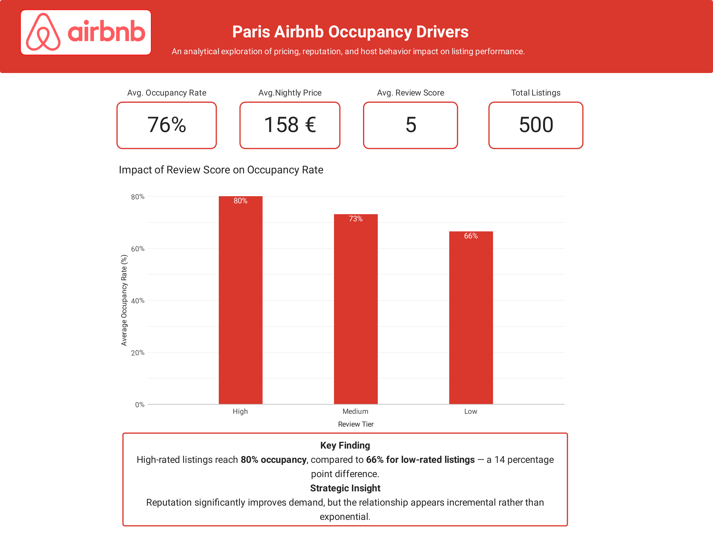
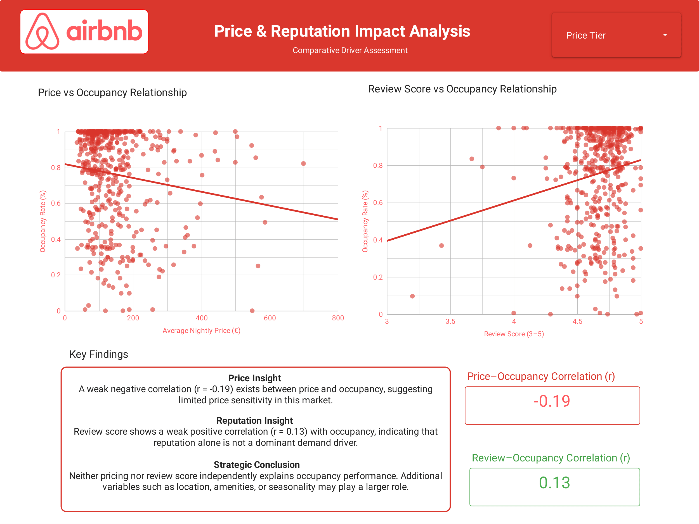

# airbnb-paris-occupancy-analysis
Analysis of pricing and reputation impact on Airbnb occupancy rates in Paris.

## Project Overview
This project analyzes key drivers affecting occupancy rates in the Paris Airbnb market, focusing on pricing strategy and reputation performance.

---

## Dashboard Preview

### Page 1 – Executive Summary

### Page 2 – Driver Impact Analysis

---

## Objectives
- Evaluate the impact of average nightly price on occupancy rate  
- Assess the influence of review scores on booking performance  
- Compare pricing and reputation as demand drivers  

---

## Tools Used
- Looker Studio  
- Data Visualization  
- Exploratory Data Analysis  
- Segmentation Modeling  

---

## Key Findings
- A moderate negative relationship exists between price and occupancy  
- Review score demonstrates a stronger and more stable positive relationship  
- Reputation management provides higher strategic return compared to aggressive price reduction  

---

## Business Implication
For hosts operating in competitive urban markets, long-term investment in service quality and guest satisfaction yields stronger occupancy performance than price-based competition.
